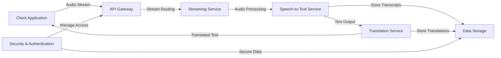

```mermaid
graph LR
    A[Client Application] -- Audio Stream --> B[API Gateway]
    B -- Stream Routing --> C[Streaming Service]
    C -- Audio Processing --> D[Speech-to-Text Service]
    D -- Text Output --> E[Translation Service]
    E -- Translated Text --> A
    D -- Store Transcripts --> F[Data Storage]
    E -- Store Translations --> F
    G[Security & Authentication] -- Manage Access --> B
    G -- Secure Data --> F
```